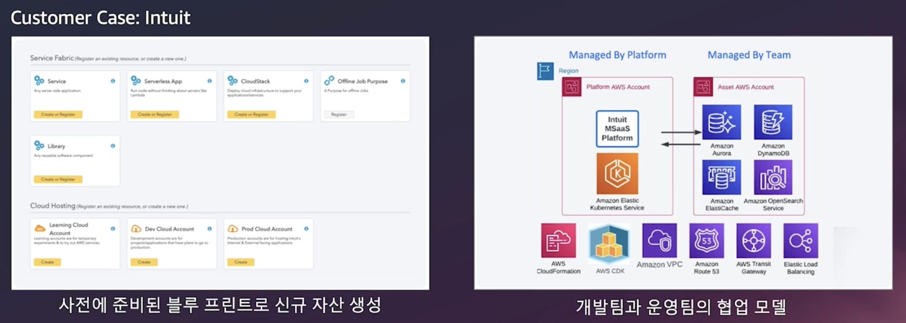

Examples of building reference infrastructure on AWS with IaC.

# Todo(what to explore)

### Amazon CodeCatalyst
* 블루프린트 기반의 신규 프로젝트 생성
* 클라우드 기반의 개발환경
* 쉽게 구성 가능한 CI/CD
* 효율적인 협업 지원

### Amazon EKS Blueprints
* EKS 클러스터를 구성하고 배포하는 오픈소스 모듈
* IaC 모듈 컬렉션
* 다양한 add-on 지원
* 테라폼, AWS CDK로 구현 가능
=> 미리 만들어진 모듈을 추가만 하는 형태로 CDK를 생성할 수 있다?

### Platform Engineering
플랫폼 엔지니어링은 자동화된 인프라 운영으로 재사용 가능한 도구와 셀프 서비스 기능을 구현하여 개발자 경험과 생산성을 개선합니다.

